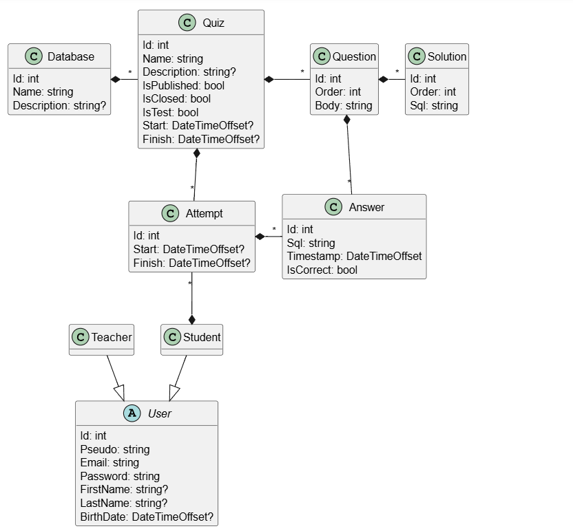
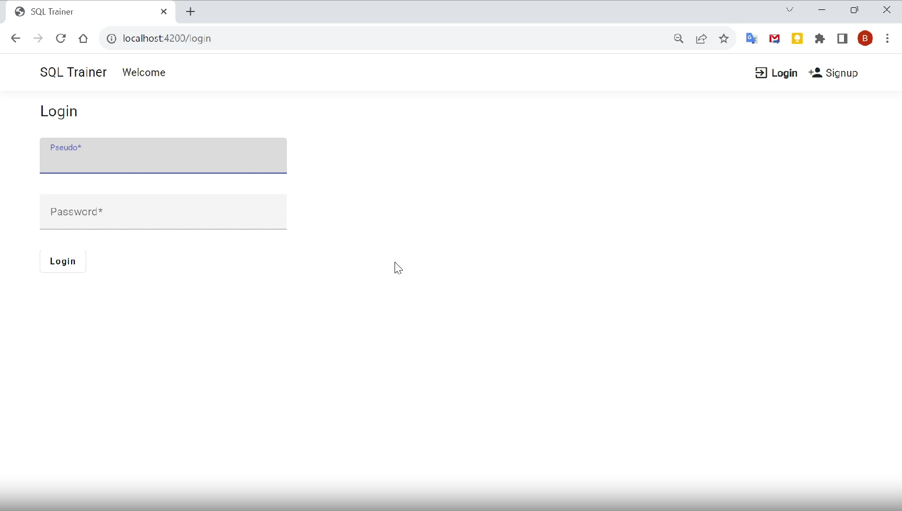
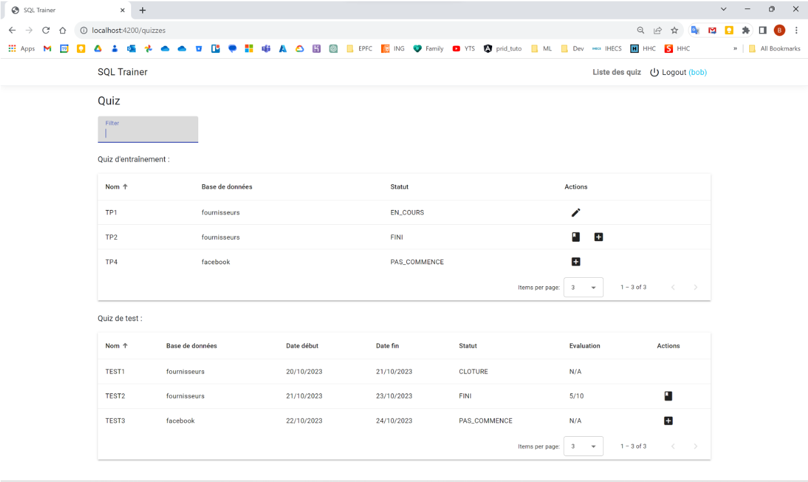
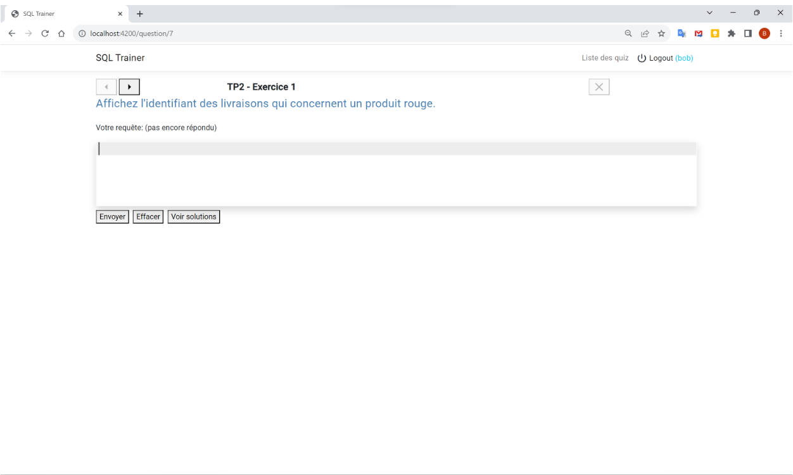
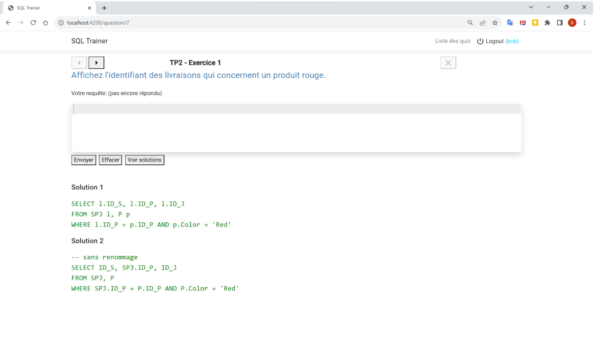
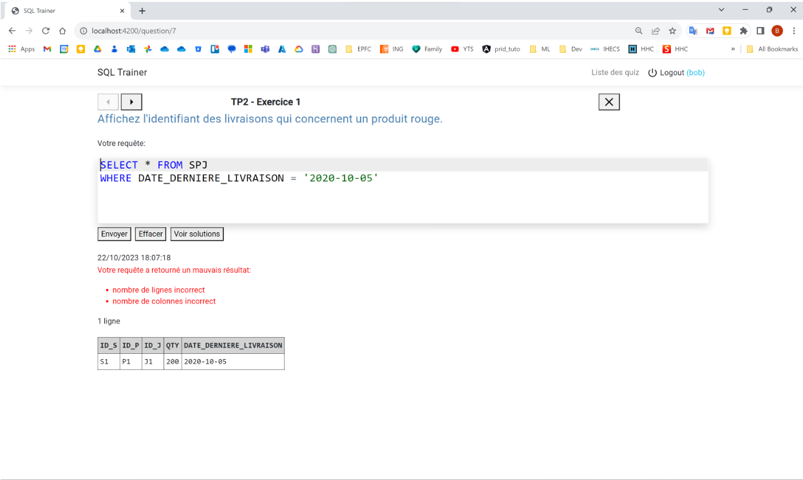
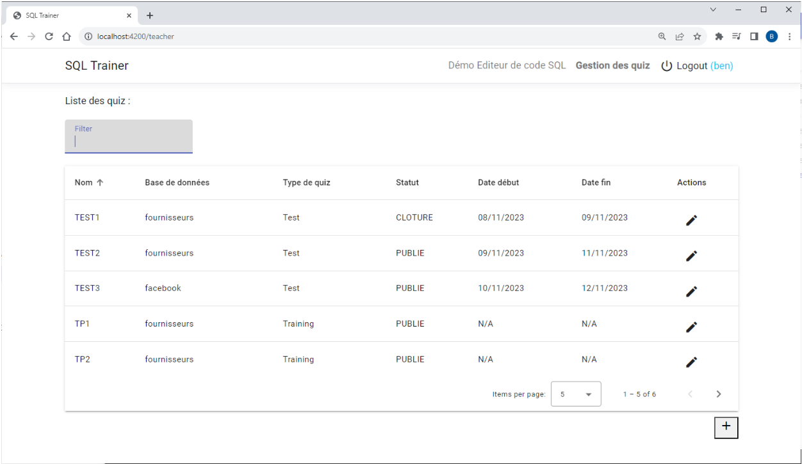
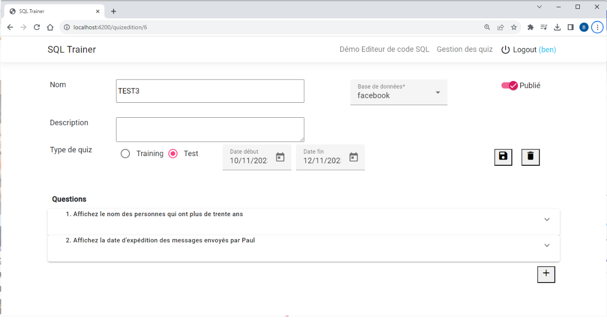
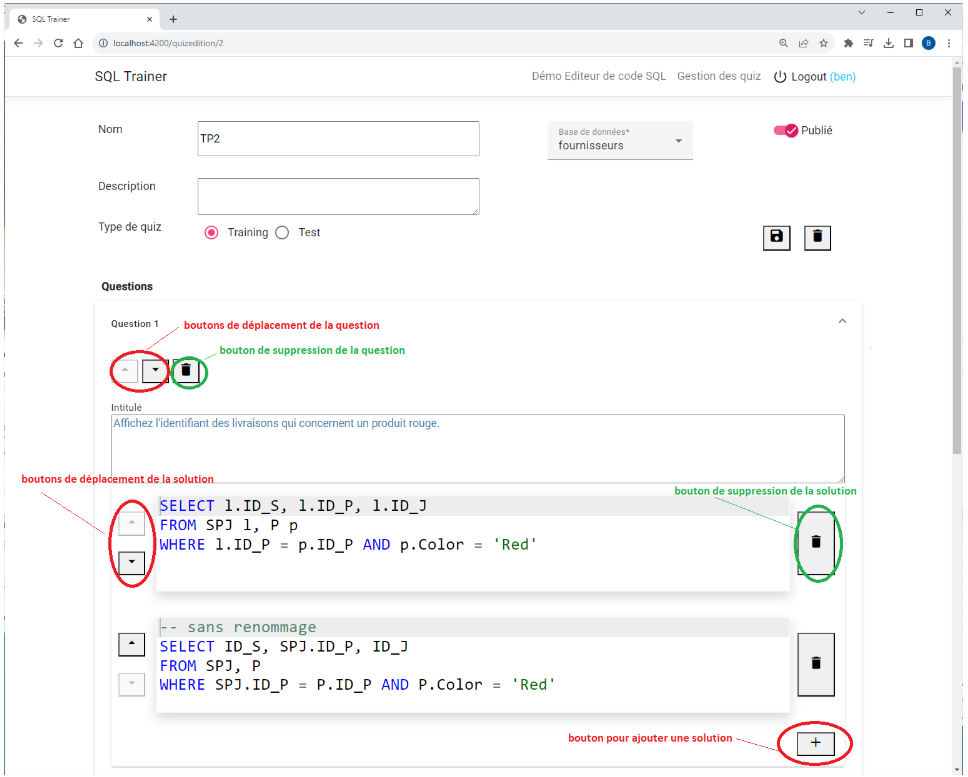

# SQL Trainer Web Application
SQL Trainer: An Interactive Tool for Learning and Practicing SQL Through Quizzes

## Technologies
* Angular
* ASP.NET Core
* Entity Framework Core

## App
### Description
The SQL Trainer application is designed to facilitate the creation, management, and administration of online quizzes in the context of a database course. 
It allows instructors to create quizzes where questions are expressed in natural language. 
Students answer these questions by submitting responses in the form of SQL queries. 
Each quiz is associated with a database schema (Database class), which is expected to be preloaded in XAMPP.

### Database

### Login

### Student
#### Quizzes List

#### Quiz

#### Good solution

#### Bad solution

### Teacher
#### Quiz managment

#### Create or edit quiz

